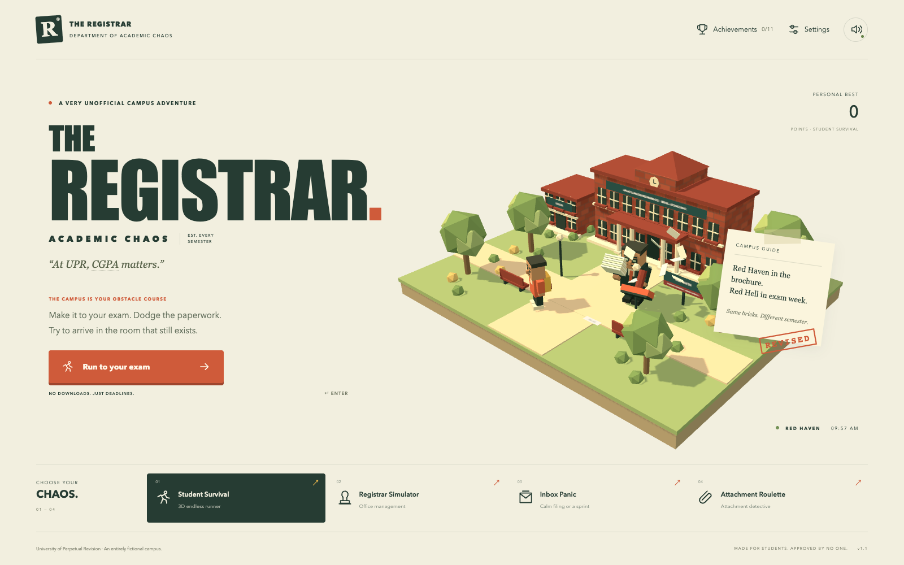

# THE REGISTRAR: Academic Chaos

A playable, static 3D campus parody set at the entirely fictional **University of Perpetual Revision (UPR)**.

> Red Haven in the brochure. Red Hell in exam week.

A red-brick campus, green campus cash, and an education in paperwork. The dollars are fictional game currency; CGPA remains a separate hidden joke.

[Play in your browser](https://abid-5as.github.io/the-registrar/) · [Build status](https://github.com/Abid-5AS/the-registrar/actions)



The satire targets contradictory rules, rote-learning incentives, marks fixation, access barriers, and paperwork culture. It does not depict a real institution or member of staff. The characters, university, documents, and scenarios are fictional. No personal names, photographs, real student IDs, analytics, backend, or API keys are used.

## Play locally

Requires Node.js 22.12+ and npm.

```sh
npm ci
npm run dev
```

Open the address printed by Vite. For the production build:

```sh
npm run build
npm run preview
```

`dist/` is the complete static game. Serve it over HTTP; opening its HTML directly with `file://` will not load JavaScript modules correctly.

## Four complete modes

**Student Survival** — a three-lane campus runner with smooth movement, jumping, sliding, short obstacles, tall cabinets, floating $1 campus dollars (+25 points each), six power-ups, three admit-card hearts, collision grace, and escalating schedule changes. Revisions clear hazards, slow time to 72%, highlight the new destination, and allow at least 6.5–9 seconds at the configured speed cap. A correct gate awards 250 points; a wrong gate uses one card. There is no single-hit death.

The first revision arrives around 30 seconds. The Registrar makes a cameo after 2½ minutes, with a 30-second inspection after roughly five minutes. Stamps have 3½-second warnings. Campus zones change ground palette, buildings, and colonnades as distance grows. Geometry and materials are shared, architecture is instanced, obstacles are pooled, and paper particles are bounded.

**Registrar Simulator** — an untimed eight-decision office day. Choices affect authority, clarity, student confusion, threat level, attachments, and revision stack. Scenarios include correct answers rejected for unfamiliar wording, attendance rules contradicted by the campus bus, unavailable lab equipment, and scholarship application fees. Reasonable choices have their own jokes and can unlock _Suspiciously Professional_. Drag stamps onto the revision desk or tap them; the filename retains the stamp sequence and papers physically pile up. Every decision, its outcome, the current meters, and the revision history save automatically. Returning to the mode resumes the exact unfinished item without applying its effects twice.

**Inbox Panic** — panic is optional. The default is six untimed batches. The newest timestamp and highest version always identify the current email. Opening an obsolete file archives it and gives a useful hint; it never costs a life or ends the session. Each correct selection gets a short receipt and a deliberate “Next batch” action. A 60-second sprint is available from the intro.

**Attachment Roulette** — eight document mysteries with readable page previews, four plausible categories, free context, and unlimited retries. Every answer follows from a visible clue. Contradictory documents provide the comedy: the controls and scoring remain consistent. Each category appears once per session. First-try deductions are counted, but every resolved document is a success.

## Controls and settings

- Left/right arrows or A/D: change lanes.
- Up/W/Space: jump.
- Down/S: slide.
- P or Escape: pause; Escape closes an open dialog. Resuming grants a brief slowdown and collision grace. Notices stay visible while paused.
- The fullscreen button appears where supported. The pause menu also offers a fresh restart.
- Mobile: swipe in four directions or use the large arrow controls. Landscape is recommended; portrait remains playable.
- The game pauses when hidden or when a timed mode loses focus.
- Settings: Relaxed, Normal, or Unhinged; reduced screen shake; reduced flashing; large text; high contrast; master, music, and notification volume; quick mute.
- Click the CGPA label five times quickly for the legendary event.

Sound starts after interaction and is synthesized locally using Web Audio. System Impact is used when available; a bundled OFL Anton font provides the display fallback. No external asset or font service is required.

## Saves

The versioned `registrar.academic-chaos.v1` localStorage entry stores best score, longest run, achievements, settings, statistics, office day, and revision stack/stamps. Invalid saves are sanitized. If storage is blocked, the session remains playable without persistence. A refresh restarts a runner or inbox/attachment round. Office days resume at the current decision; completed progression persists in all modes.

## Deploy to GitHub Pages

1. Put this project's contents at the root of a GitHub repository.
2. Push to `main`, or adjust the branch in `.github/workflows/deploy.yml`.
3. In the repository's **Settings → Pages**, choose **GitHub Actions** as the source.
4. The included workflow installs dependencies and Chromium, runs unit and production-browser tests, then deploys `dist/`. Pull requests run the same checks without publishing.

Vite uses `base: './'`, so compiled assets resolve relative to the page. The static production game is tested under `/registrar-simulator/`, not only at `/`. It also works at another repository subpath without rebuilding.

Deployment guidance: [Vite static deployment documentation](https://vite.dev/guide/static-deploy.html).

## Verification

```sh
npm test
npx playwright install chromium
npm run test:release
```

`test:release` builds the game, starts a temporary static HTTP server at a repository-style subpath, exercises all modes, runs the revision/sprint timing checks, and shuts down the test server. It requires no separately running dev server. Screenshots and JSON records go in `test-results/`.

To use an already installed Chrome instead of Playwright's bundled Chromium:

```sh
PLAYWRIGHT_CHANNEL=chrome npm run test:release
```

For an existing server, `GAME_URL=http://localhost:5173 npm run test:browser` runs the interaction suite. `QA_DIR` overrides the screenshot directory. `npm run format` formats the source and configuration files.

See [QA.md](QA.md) for the validation record and remaining hardware/browser coverage limits. Third-party code is locked through `package-lock.json`; GitHub Actions references are pinned.

## Source map

- `src/Game.ts`: mode lifecycle, input, accessible HTML interface, mini-game rules, and pause/dialog handling.
- `src/world/World.ts`: procedural Three.js campus, office/common room, characters, pooled props, instanced architecture, and animation.
- `src/systems/RunnerSystem.ts`: pure runner simulation and fairness rules.
- `src/systems/SaveManager.ts`: schema validation and local persistence.
- `src/systems/AudioManager.ts`: restrained synthesized music and effects.
- `src/data/`: fictional office events, clue-based attachment cases, comedy receipts, and achievements.
- `src/style.css`: responsive interface and accessibility styles.

There is one rendering system and no physics dependency. Third-party notices are retained in `licenses/`.
